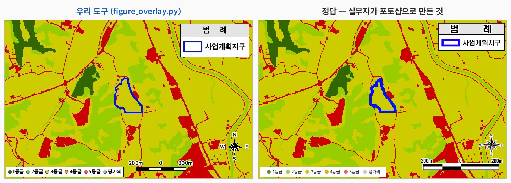

# 삽도 자동화 — 베이스 지도 취득과 오버레이 (2026-08-19)

> 2026-08-13 미팅 요청 — *"지역개황에서 이미지에 글자를 쓰거나 구역 표시하는 것 같은 게 있는데
> 이런 것도 가능한지"* — 에 대한 조사·구현·테스트 기록.
>
> **한 줄 결론**: **좌표 하나로 지도를 받아 삽도를 만드는 데까지 이어진다.**
> 베이스 출처는 **4곳**이고 조건이 각각 다르다 — **공공 2곳은 자동 취득 실증 완료**,
> 지형도는 웹 다운로드, **카카오맵(민간)은 약관 확인이 먼저**다.
>
> 코드: `engine/map_fetch.py`(받기) · `engine/figure_overlay.py`(그리기) · `engine/psd_base.py`(PSD 베이스 추출)

---

## 1. 삽도는 3층이다

골든셋 PSD 를 열어 확인한 구조다. **실무자가 이미 이렇게 작업하고 있었다.**

| 층 | 내용 | 누가 |
|:--:|---|---|
| **① 베이스 지도** | 지형도 · 국토환경성평가지도 · 생태자연도 · 위성사진 | **외부에서 받아 온다** |
| **② 오버레이** | 사업지 경계 · 라벨 박스 · 표적 마커 · 구역 채색 · 흐름 화살표 · 지명 · **정온시설 분포** | **우리가 그린다** |
| **③ 장식** | 범례 · 축척 막대 · 방위표 | 우리가 그린다 (고정 서식) |

근거 — 괴산 `국토환경성평가지도.psd` (문서 700×450, 레이어 14):

```
1813×799  레이어 2        ← ① 베이스 (웹 지도 캡처)
  74×95   경계            ← ② 사업지 경계
 107×18   사업계획지구      ← ② 라벨
 193×82   범례 · 213×17 축척 · 66×61 방위   ← ③ 장식
```

### 실무자는 포토샵으로 만들고 있었다

```
웹에서 지도 받기(캡처 또는 다운로드)  →  포토샵에 배경으로 깔기
   →  경계·라벨·범례 레이어 얹기  →  [.psd 로 저장]  →  JPG 로 내보내 hwp 에 삽입
```

**PSD 는 중간 작업 파일이고, 보고서에 들어가는 것은 JPG 다.** 삽도 폴더에 쌍으로 남아 있다 —
`생태자연도.psd` 40.7MB ↔ `생태자연도.jpg` 1.3MB · `수계도.psd` 149MB ↔ `수계도.jpg` 5.3MB.
hwp 안에 실제로 박혀 있는 것도 JPG 다.

**직접 확인하려면** `raw_data/nas/figures/괴산_금신리/` — 쌍을 받아 두었다
(`국토환경성평가지도` psd 1.8MB ↔ jpg 306KB · `위성사진` psd 30MB ↔ jpg 2.3MB ·
`수계흐름모식도` · `표고표고`). 원본은 NAS `환25-18 괴산…/3. 삽도/` (59개).
PSD 는 포토샵이나 `python engine/psd_base.py <파일> --list` 로 레이어를 볼 수 있다.

> **그래서 우리 산출물도 JPG 면 된다.** PSD 로 뱉을 필요가 없다.
> 대신 **spec(JSON)을 함께 남긴다** — 라벨 위치를 바꾸려면 숫자만 고쳐 다시 그리면 되고,
> 포토샵 없이도 수정된다. PSD 보다 가볍고 되돌리기 쉽다.

(*PSD 는 포토샵 파일 확장자다. JPG 와 달리 **레이어가 따로 살아 있어**, 배경 지도만 꺼낼 수 있다 —
이 성질 덕에 기존 사업의 깨끗한 베이스를 되찾을 수 있었다.*)

---

## 2. 베이스 출처 4곳 — 언제 무엇을 쓰나 ★

**한 곳에서 다 받을 수 없다.** 삽도 종류마다 출처가 다르다.

| # | 출처 | 이 지도가 필요한 삽도 | 성격 | 실측 증거 |
|:-:|---|---|:--:|---|
| **1** | **국토지리정보원** 지형도 | **지역개황도 · 수계도(유역도) · 위치도** | 공공 | `367034 청안_1.jpg` (2,060×2,978) 에 기관 로고 인쇄 |
| **2** | **환경부 EGIS** 환경주제도 | **생태·자연도**, 각종 지정구역 | 공공 | 골든셋 출처 주석 · WMS 요청 성공 |
| **3** | **ECVAM** 국토환경성평가지도 | 국토환경성평가지도 (지역개황 밖 파트) | 공공 | 베이스 레이어에 ECVAM 웹 UI |
| **4** | ⚠️ **카카오맵** 위성 | **위성사진** (현황·경관·측정지점 배경) | **민간** | 우하단 `kakao, 국토지리정보원` 워터마크 |

### 외부 지도가 필요 없는 삽도

| 삽도 | 정체 |
|---|---|
| **식생보전등급도** | 동식물상 조사의 **자체 GIS 산출물** — 등급 폴리곤 + 범례 |
| **수계흐름모식도** | **직접 작도한 도식** (PSD 레이어가 사각형·화살표·텍스트뿐) |

### ⚠️ 카카오맵만 성격이 다르다

앞의 셋은 공공이라 이용 조건이 명확한데 **카카오맵은 민간 서비스**다. 보고서에 넣어 **납품**하는
용도는 조건이 다를 수 있다. 게다가 실무자는 **화면 4장(각 1,910×870)을 이어붙여** 한 장을 만들었다
(`위성사진.psd` 레이어 131개) — 손이 가장 많이 가는 자리이기도 하다.

공공 대안은 **국토지리정보원 정사영상**·**VWorld 항공영상**이지만 화질·최신성이 다를 수 있다.
**실무자가 카카오를 쓴 이유가 거기 있을 것**이므로 대체 가능 여부는 실무 판단이다.
→ `docs/실무자_확인요청.md` 에 질문으로 넣어 두었다 (위성사진을 공공 영상으로 바꿔도 되는지).

---

## 2-1. 지역개황에 이미지가 몇 장 들어가나 (골든셋 8건 실측)

### 캡션이 붙은 삽도 = **6종** (8/8 사업 동일)

| 그림 번호 | 이름 | 베이스 출처 | **자동화 상태** |
|---|---|---|:--:|
| 2.8-1 | 생태·자연도 | 환경부 EGIS / EcoBank | ◐ 베이스 출처 조사 중 |
| 2.8-2 | 식생보전등급도 | **없음 — 동식물상 조사의 GIS 산출물** | ✗ 우리 몫이 아니다 |
| 2.8-3 | 수계흐름모식도 | **없음 — 직접 작도한 도식** | ○ 그릴 수 있다 (미구현) |
| 2.8-4 | 수계도(유역도) | 국토지리정보원 지형도 | ◐ 베이스가 웹 다운로드 |
| **2.9-1** | **정온시설 및 개발시설 현황** | 위성·지도 | **● 완전 자동** (`polar` 로 표→마커) |
| 2.10-1 | 지역개황도 | 국토지리정보원 지형도 | ◐ 베이스가 웹 다운로드 |

**● 완전 1 · ○ 가능하나 미구현 1 · ◐ 오버레이만 자동 3 · ✗ 대상 아님 1**

- **그리는 쪽(오버레이)은 6종 중 5종이 된다** — 식생보전등급도만 외부 산출물이라 제외
- **베이스까지 자동인 것은 1~2종** — 나머지는 지형도 웹 다운로드나 출처 조사가 남았다
- 베이스 취득이 풀리면 **5/6(83%)** 이 자동화 범위에 들어온다

### 실제 파일 개수는 그보다 많다 (사업당 24~37장)

hwp 안의 이미지를 전수로 세면 이렇다.

| 유형 | 8건 합계 | 사업당 | 자동화 |
|---|--:|---|:--:|
| **지도·도면류** | 81 | 3~20 | 위 6종 + 표·법령 캡처 등 부속 |
| **현장사진** (6960×4640 DSLR 원본) | 55 | 1~14 | ✗ **현장 촬영이라 대상 아님** |
| 기호·범례 조각 | 109 | 7~16 | 문서 서식의 일부 |
| 합계 | **245** | 24~37 | |

> 캡션이 붙은 6종이 "삽도"이고, 나머지는 표 안 기호나 부속 이미지다.
> **현장사진 55장은 자동화 대상이 아니다** — 실무자가 현장에 나가 찍는다.
> 다만 정온시설 사진이라 **정온시설 표와 짝이 맞아야** 하고, 그 표는 우리가 다룬다.

---

## 3. 자동 취득 — 어디까지 되는지 실제로 때려봤다

### 3-1. 환경부 EGIS — ✅ **인증키 없이 된다** (실증 완료)

```
엔드포인트   https://api.mcee.go.kr/geoserver/me/wms
```

| 요청 | 결과 |
|---|---|
| `GetCapabilities` | **HTTP 200**, 330KB — **레이어 120종** (물환경 73 · 기후대기 56 · 자연환경 37) |
| `GetMap` (괴산 좌표, 800×800, EPSG:3857) | **HTTP 200, `image/png` 32KB — 실제 지도 반환** |

인증키 파라미터가 **아예 없다.** 신청할 것이 없다.
※ `http://` 로 요청하면 302 → **`https://` 로 직접 요청**할 것.

> ⚠️ 다만 **생태·자연도 등급도는 이 120종 목록에 없었다.** EGIS 상단에 `생태자연도` 메뉴가
> 따로 있는 걸 보면 별도 시스템이다 — **추가 조사 필요**.

### 3-2. ECVAM 국토환경성평가지도 — ✅ **TMS 로 성공** (키 발급 후 실증)

키를 발급받아(`~/.ecvam.env`, 권한 600) 두 방식을 다 시험했다. **방식에 따라 갈렸다.**

| 방식 | 엔드포인트 | 결과 |
|---|---|---|
| `apiConfirm.do?APIKEY=…` | 인증 확인 | **HTTP 200** — 레이어 72종 목록 반환. **키 유효 확인** |
| **WMS** `apicall.do` GetMap | 웹 임베드용 | ❌ HTTP 200 이지만 **0바이트**. GetCapabilities 404 · 브라우저 `fetch` CORS 차단 · `` onerror |
| **TMS** `webgis.neins.go.kr/tms/…` | GIS 툴용 | ✅ **성공** |

**성공한 형식** (TMS API 사용자 매뉴얼 PDF 에서 확인):

```
https://webgis.neins.go.kr/tms/[레이어]/[API키]/{z}/{x}/{y}
예)                        ECVAM_nem_ecvam         z=15
```

- 레이어 이름에 **`ECVAM_` 접두어**가 붙는다 (`nem_ecvam` 만 쓰면 404)
- **XYZ 방식**이다 — y 를 뒤집는 TMS 규약으로 요청하면 거의 빈 타일이 온다
- 3×3 타일 **9/9 성공** → 768×768 합성 확인

> **왜 WMS 는 막혔나**: `apicall.do` 는 `<script src="…apiConfirm.do?APIKEY=…">` 로
> **웹페이지에 임베드**하는 전제이고, 신청 때 등록한 **사용 URL 과 호출 출처가 일치**해야 한다
> (가이드 오류 목록의 `인증 URL 불일치`). 우리는 사용 URL 을 **`QGIS`** 로 등록했고,
> 그 등록값에 맞는 경로가 **TMS** 였다. 매뉴얼도 *"사용URL은 QGIS로 입력한다"* 고 안내한다.
>
> 즉 **등록값과 호출 방식을 맞추면 된다.** 웹페이지에 띄울 계획이 생기면 그때 도메인을 등록한다.

### 3-3. 국토지리정보원 지형도 — 웹 다운로드 (미실행)

국토정보플랫폼에서 **도엽 단위**로 받는다. 도엽번호 체계는 공공데이터포털에 파일로 공개돼 있어
**주소 → 도엽번호 → 다운로드** 자동화의 근거가 된다.

### 3-4. 카카오맵 — 약관 확인이 먼저다

민간 서비스라 앞의 셋과 조건이 다르다. 실무자 확인 대기.

---

## 4. 신규 지역 대응 — 주소 한 줄에서 시작된다 (실증)

ECVAM 다운로드 페이지에서 **임의 지번**으로 확인한 흐름이다.

```
"괴산군 청안면 금신리 155-1"  검색
   → 행정구역 결과 1건
   → 좌표 노출  EPSG:3857  (14208655.63, 4406482.02)
   → 도엽 조회 → [선택도엽 다운로드] 도달
```

**인증키 없이 여기까지 간다.** 이 좌표는 두 곳에 그대로 쓰인다:

- **지도 요청의 중심 좌표** — 이 좌표로 EGIS·ECVAM 요청이 실제로 성공했다
- **삽도의 사업지 마커 위치** — 정온시설 자동 배치(`polar`)의 원점이 된다

> ⚠️ 다운로드 직전에 **설문**(연령대·성별·직업·활용목적)이 뜬다. 개인정보라 사람이 입력해야 한다.
> **사업당 1회**면 되므로 실무 부담은 작다.

---

## 5. 오버레이 — 어디까지 자동화되나 (테스트 결과) ★

`engine/figure_overlay.py`. spec(JSON)에 요소를 적으면 베이스 위에 그린다.

```bash
python engine/figure_overlay.py --demo             # 요소 10종 렌더
python engine/figure_overlay.py spec.json -o 삽도.jpg
```

### 5-1. 자동화 등급

| 요소 | 자동화 | 필요한 입력 | 테스트 |
|---|:--:|---|:--:|
| 표적 마커 (`target`) | **완전** | 사업지 좌표 1개 | ✅ |
| 라벨 박스 + 지시선 (`label`) | **완전** | 좌표 + 문구 | ✅ |
| **정온시설 분포 (`polar`)** | **완전** ★ | **보고서의 정온시설 표 그대로** (라벨·방향·거리) | ✅ 원주 5개 · 괴산 9개 |
| 지명 (`place`) | **완전** | 좌표 + 이름 | ✅ |
| 범례·축척·방위 (`legend`·`scalebar`·`north`) | **완전** | 없음 (고정 서식) | ✅ |
| 사업지 경계선 (`boundary`) | **조건부 완전** | **경계 좌표열** — 설계도서에 있다 | ✅ (임의 좌표로) |
| 하천 흐름 화살표 (`flow`) | **반자동** | 경로 점 몇 개 → 방향·간격은 자동 | ✅ |
| 구역 채색 (`zone`) | **반자동** | **구역 경계 데이터가 따로 필요** | ✅ (임의 폴리곤) |

### 5-2. 배치는 기본값이 있다 — 정답에서 뽑았다

범례·방위표·축척은 **`at` 을 안 적으면 골든셋 정답과 같은 자리**에 놓인다.
괴산 국토환경성평가지도(700×450)에서 실측한 위치를 **비율로 환산**해 기본값으로 넣었다.

| 요소 | 기본 위치 | 근거 |
|---|---|---|
| 세로 범례 (`범 례` 박스) | 오른쪽 위 `(0.726, 0.024)` | 정답 실측 (508, 11) |
| 가로 등급 띠 | 왼쪽 아래 `(0.007, 0.924)` | 정답 실측 (5, 416) |
| 축척 막대 (왼쪽 끝) | 등급 띠 **오른쪽 옆, 같은 줄** `(0.530, 0.930)` · 길이 = 폭의 20% |
| 방위표 (중심) | 축척 **위쪽** 오른쪽 `(0.927, 0.800)` |

세 요소가 아래쪽에서 **왼쪽부터 [등급 띠][축척] · 그 위 [방위표]** 로 늘어선다.
정답의 배치를 따르면서 서로 겹치지 않는 조합이다.

축척 라벨 형식도 정답을 따른다 — **`200m ─ 0 ─ 200m`** (가운데가 0, 양쪽에 거리).

**글씨는 볼드**를 기본으로 쓴다 (Apple SD Gothic Neo Bold / 맑은 고딕 Bold / 나눔고딕 Bold).
골든셋 삽도의 라벨이 굵은 글씨였다.

가로 등급 띠는 **실제 그리는 폭으로 상자를 잡는다** — 마지막 항목 뒤 여백을 빼지 않으면
오른쪽이 비어 정답(폭 354/700)보다 길어진다.

비율이라 **삽도 크기가 달라져도 같은 자리**다 — 700×450 과 768×768 양쪽에서 확인했다.
옮기고 싶을 때만 `at: [x, y]` 를 적으면 그쪽이 이긴다.

```json
{"type": "north"}                    ← 기본 자리 (오른쪽 아래)
{"type": "north", "at": [60, 60]}    ← 왼쪽 위로 옮김
```

### 5-3. 정답과 나란히 — 스타일을 어디까지 맞췄나 ★



왼쪽이 `figure_overlay.py` 산출물, 오른쪽이 실무자가 포토샵으로 만든 정답이다.
**같은 배경 지도 위에 같은 구성요소**가 올라간다.

#### 무엇을 보고 정했나 — 전부 정답에서 실측했다

색·크기·위치를 임의로 고르지 않았다. 정답 이미지의 픽셀을 재서 값을 뽑았다.

| 항목 | 정한 값 | 어떻게 |
|---|---|---|
| 경계선 색 | `#0100FF` | 정답의 파란 픽셀 평균 `(15,30,244)` |
| 라벨 박스 | 배경 `#636363` · 글자 `#FFF200` · 테두리 `#C81E1E` | 유역도 라벨에서 추출 |
| 범례 위치 | 오른쪽 위 `(0.708, 0.024)` | 정답 박스 좌상단 (508, 11) |
| 등급 띠 위치 | 왼쪽 아래 `(0.007, 0.924)` | 정답 띠 좌상단 (5, 416) |
| 축척·방위표 | 등급 띠 옆 · 그 위 | 정답 배치를 따르되 겹치지 않게 |
| 축척 라벨 형식 | `200m ─ 0 ─ 200m` | 정답 확대 판독 |
| 글씨 | **볼드** | 정답 라벨이 굵은 글씨 |

#### 남은 차이 (2026-08-19 기준)

| 항목 | 우리 | 정답 | 원인 |
|---|--:|--:|---|
| 경계선 픽셀 | 1,211 | 2,297 | **선이 얇다** + 경계 좌표를 정답에서 역추출해 꼭짓점 18개로 단순화한 탓 |
| 범례 박스 | 191×88 | 184×73 | 세로로 15px 크다 (행 높이 여유) |
| 등급 띠 | 381×38 | 354×28 | 글자가 조금 크다 |

전부 **숫자 조정으로 좁힐 수 있는 차이**다. 실전에서는 경계 좌표를 설계도서에서 받으므로
첫 줄의 큰 차이는 저절로 사라진다. 어디까지 맞출지는 실무자 확인 후 정하는 편이 낫다 —
지금도 "같은 종류의 그림"으로 보이는 수준이다.

### 5-4. `polar` 가 이 모듈의 값어치다 ★

지역개황 「정온 및 개발시설 현황」 표(2.9.1)가 `라벨 | 방향 | 이격거리(m)` 형태다. **사업지 중심 좌표와 축척만 주면
표에서 바로 지점 분포도가 나온다** — 지점마다 좌표를 찍을 필요가 없다.

```json
{"type": "polar", "origin": [770, 560], "px_per_m": 0.42, "items": [
   {"label": "민가1", "dir": "남동", "dist_m": 46},
   {"label": "축사1", "dir": "남",   "dist_m": 314}]}
```

> ⚠️ **16방위라 실제 방위각과 최대 ±11° 차가 난다.** 분포를 보여주는 용도이고,
> 정확한 위치가 필요하면 좌표를 받아야 한다.
> `인접` 같은 **비수치 이격거리(평창)는 건너뛴다** — 없는 위치를 지어내지 않는다.

### 5-5. 전 과정 실증 — **좌표 → 완성 삽도** ★

```
좌표(EPSG:3857) → map_fetch → 지도 768×768 → figure_overlay → 완성 삽도
```

```bash
python engine/map_fetch.py --xy 14208655.63 4406482.02 --source ecvam -o base.png
#   tiles 9/9 · px_per_m 0.261297 · center_px [497.2, 503.6]
python engine/figure_overlay.py spec.json -o 삽도.jpg
```

괴산 금신리 좌표로 지도를 받고, **골든셋의 정온시설 표 9개를 그대로 얹었다**
(민가1~4 · 축사1~5). 지점 좌표는 하나도 입력하지 않았다 — 표의 방향·거리만으로 배치된다.

**`map_fetch` 가 돌려주는 `px_per_m` 과 `center_px` 가 `polar` 의 입력과 정확히 맞물린다.**
축척을 사람이 재지 않아도 된다는 뜻이고, 이 연결이 이 파이프라인의 핵심이다.

**참고 — PSD 경로** (기존 사업 재현·검증용):
`psd_base.py` 로 괴산 `국토환경성평가지도.psd` 에서 베이스 레이어만 뽑아(1,813×799) 같은 방식으로
합성해봤다. 그전 시연은 **완성된 삽도 위에 덧그린 것**이라 재현 증거가 아니었는데, 이 단계에서
그 한계를 풀었다.

---

## 6. 아직 안 되는 것 (정직하게)

| 항목 | 왜 |
|---|---|
| **지형도 자동 취득** | 국토정보플랫폼 **웹 다운로드**라 아직 스크립트로 못 받는다. 도엽번호 데이터는 공개돼 있다 |
| **카카오맵 위성** | 민간 서비스 — **약관 확인이 먼저**다 (실무자 확인 요청함) |
| **생태·자연도 등급도** | EGIS WMS 레이어 120종에 없다. 별도 시스템 추정 — 조사 필요 |
| **주소 → 좌표 자동화** | 지금은 ECVAM 검색 화면에서 좌표를 읽어 온다. 지오코딩 API 연결 필요 |
| **라벨 겹침** | 정온시설이 몰린 방향이면 라벨이 포개진다 — 회피 배치 미구현 |
| **구역 채색의 실제 경계** | 상수원보호구역 등 폴리곤 좌표를 어디서 받을지 미정 (WMS 로 받으면 이미지라 채색은 이미 돼 있다 — 오히려 쉬울 수 있다) |
| **사업지 경계 좌표** | 설계도서(dwg/shp)에 있으나 **파이프라인으로 못 꺼내고 있다** |
| **웹 UI 자동 제거** | `--crop-ui` 는 가장자리를 비율로 자를 뿐이다. 캡처 방식이면 눈으로 확인해야 한다 |

---

## 7. 다음 단계

1. **주소 → 좌표** 지오코딩 연결 (마지막 남은 수동 단계)
2. 생태·자연도 등급도 출처 조사
3. 국토정보플랫폼 도엽 다운로드 자동화 (도엽번호 데이터 활용)
4. 실무자 확인 — 카카오맵 위성사진을 공공 영상으로 대체해도 되는지
5. 사업지 경계 좌표를 설계도서에서 꺼내는 경로 (dwg/shp 파싱)
6. 라벨 겹침 회피 배치

---

## 부록. 코드

| 파일 | 역할 |
|---|---|
| [`engine/map_fetch.py`](../engine/map_fetch.py) | **좌표 → 베이스 지도** (ECVAM TMS · EGIS WMS). `px_per_m` 을 돌려줘 오버레이와 물린다 |
| [`engine/figure_overlay.py`](../engine/figure_overlay.py) | 오버레이 10종 렌더 (spec JSON → 이미지) |
| [`engine/psd_base.py`](../engine/psd_base.py) | 삽도 PSD → 베이스 레이어 추출 (`--list`, `--crop-ui`) |

**인증**: ECVAM 키는 `~/.ecvam.env` 의 `ECVAM_API_KEY` (권한 600). 코드는 파일만 읽고
키를 로그에 남기지 않는다 — `catalog/synology_filestation.py` 가 `~/.synology.env` 를 쓰는 것과 같다.

> NAS 삽도 PSD **34,385개**(생태자연도 604 · 수계도 589 · 위성사진 923 · 지역개황도 253 · 정온시설 248)는
> **개발·검증 자산**이다 — 스타일 학습과 재현 검증에 쓴다. **신규 사업은 웹에서 새로 받는다.**
> HWP BinData 는 zlib raw deflate 이므로 `zlib.decompress(data, -15)` 로 풀어야 JPEG 가 나온다.
