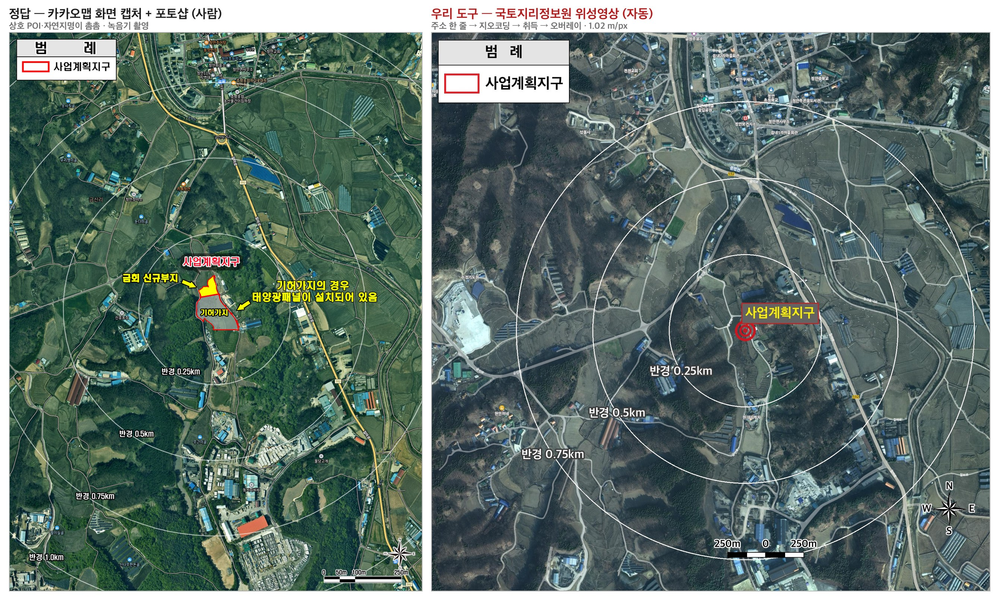
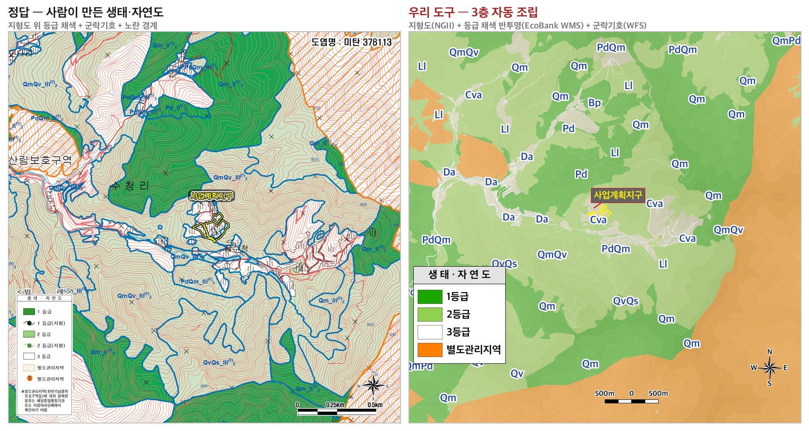
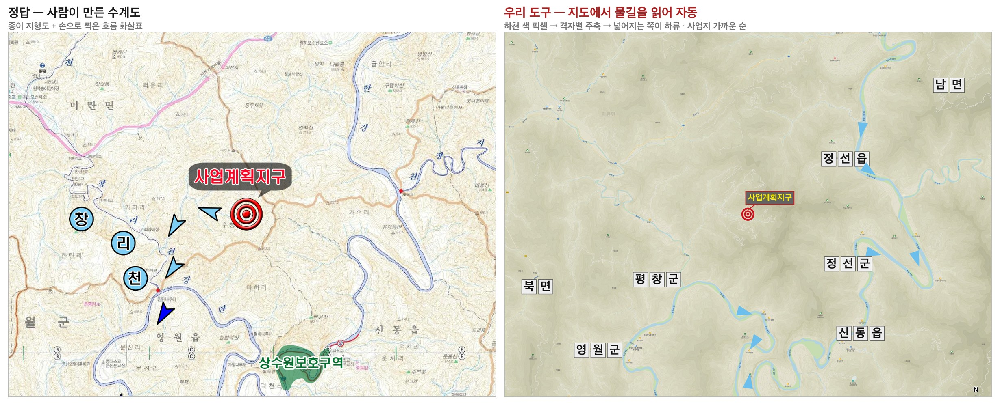
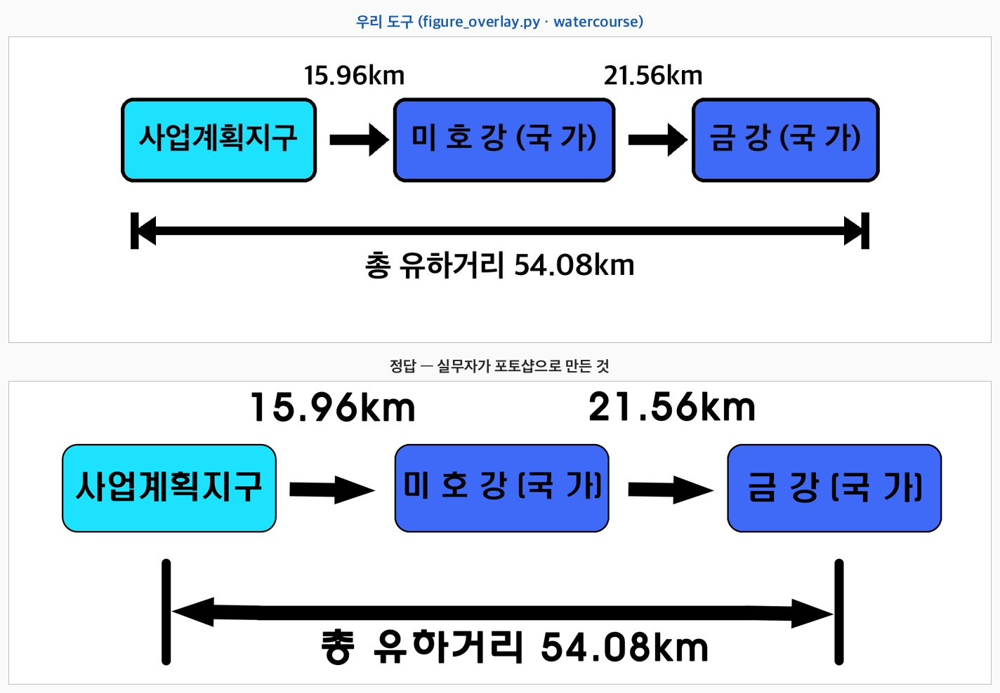
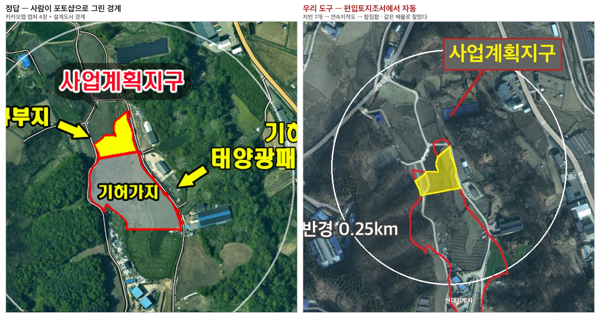
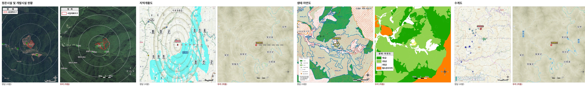
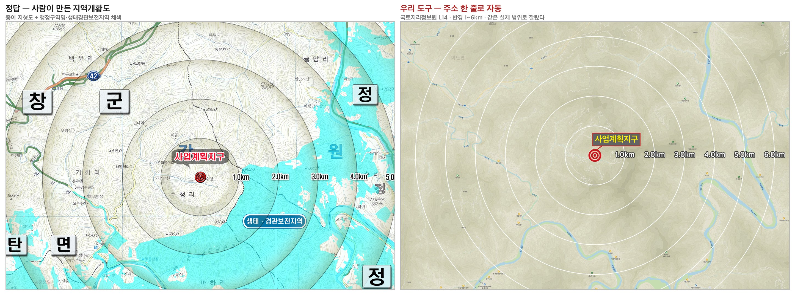

# 지역개황 삽도 자동화 — 조사·구현·검증 (2026-08-19~20)

> 2026-08-13 미팅 요청 — *"지역개황에서 이미지에 글자를 쓰거나 구역 표시하는 것 같은 게 있는데
> 이런 것도 가능한지"* — 에 대한 답이자 **다음 미팅 자료**다. 무엇이 자동화됐고 결과가
> 정답과 얼마나 같은지를 담는다. **구현 상세**(취득 URL·명령·코드 함정)는 여기 없다 —
> `engine/` 각 모듈의 주석이 정본이다 (부록 A).
>
> 코드: `engine/map_fetch.py`(지도 받기·지오코딩) · `engine/figure_overlay.py`(그리기) ·
> `engine/psd_base.py`(옛 PSD 에서 베이스 추출)

---

## 요약 — 한 장으로

**사업 주소 한 줄이면 삽도가 나온다.**

```
"충청북도 괴산군 청안면 금신리 155-1"
   → 지오코딩 → 좌표 (14208655.63, 4406482.02)
   → 축척 자동 선택 → 지형도·위성영상 취득
   → 편입토지조서 지번 → 연속지적도 → 사업지 경계 폴리곤
   → 정온시설 표를 마커로 배치 → 반경 동심원 → 범례·축척·방위 → 완성 삽도(JPG)
```

사람이 넣는 것은 **주소 한 줄**뿐이다. 정온시설 표도 사업지 경계도 보고서 안에 이미 있다.
좌표·축척·타일 좌표·마커 위치·필지 경계·범례 배치·축척 라벨은 전부 계산된다.

> 아래는 **정답과 얼마나 같은가** 다. 같은 사업(평창)으로 정답 삽도와 실제로 맞춰 본
> 결과다 → 4-5

| 삽도 6종 | 정답 대비 | 남은 것 |
|---|:--:|---|
| 정온시설 및 개발시설 현황 (2.9-1) | **● 근접** | **배경이 위성영상**이다(3-1-1) · 등고선 오버레이 |
| 수계흐름모식도 (2.8-3) | **● 근접** | — |
| 지역개황도 (2.10-1) | ◑ 거의 | **생태·경관보전지역 채색** (자료를 못 찾았다) |
| **생태·자연도 (2.8-1)** | **● 근접** | 3층 조립됨(3-2-2) — 남은 것은 도엽명·범례 세분(지형 아이콘) |
| 수계도·유역도 (2.8-4) | **● 근접** | 화살표·하천명·**상수원보호구역 채색**까지 나온다(3-4) |
| 식생보전등급도 (2.8-2) | ▣ **다른 파트** | 동식물상(7.1.1)이 만들고 지역개황은 **인용만** 한다 → 1-1 |

**지역개황이 만드는 5종 중 — 정답에 근접 4 · 거의 1.**
나머지 1종(식생보전등급도)은 다른 파트 산출물이다.

요소 15종이 다 자동인데 등급이 갈리는 이유 — **차이는 요소가 아니라 셋 중 하나다.**

| 차이의 성격 | 걸린 삽도 |
|---|---|
| ① **자료가 없는 조각** — 펜은 있는데 잉크가 없다 | 지역개황도 (생태·경관보전지역, F-10) |
| ② **베이스의 질감** — 종이 도엽 ↔ 디지털 타일, 계절 | 전부 조금씩 (F-11) |

---

## 1. 지역개황의 삽도는 어떻게 구성되나

### 1-1. 삽도는 6종 — **두 가지로 세어 맞췄다**

세는 방법이 하나로는 부족했다.

| 세는 법 | 무엇을 알려주나 | 한계 |
|---|---|---|
| **캡션 기반** — 그림 번호가 붙은 것 | 우리가 **만들어야 할** 삽도 | hwp 추출본은 그림·표 캡션이 **같은 모양**이라 기계적으로 못 센다 |
| **파일 전수** — hwp 안 이미지 전부 | 문서에 그림이 **얼마나** 들어가나 (→ 1-2) | 어느 것이 보고서 그림인지 알 수 없다 |

캡션 쪽 한계는 **청주로 풀었다.** 8건 중 청주만 PDF 유래라 `<그림 2.9-1>` 형태가 살아 있다.
그 목록을 기준으로 삼아 나머지 7건에서 같은 이름을 찾아 대조했다 — **8/8 동일**.

두 방법을 맞물려야 확신이 선다. 캡션만 세면 빠뜨리고(실제로 정온시설 분포도를 놓쳤다),
파일만 세면 245장 중 어느 것이 보고서 그림인지 가려낼 수 없다.

| 그림 번호 | 이름 | 무엇을 보이나 |
|---|---|---|
| 2.8-1 | 생태·자연도 | 사업지 일대의 생태 등급(1~3등급·별도관리지역) |
| 2.8-2 | 식생보전등급도 | 식생보전 Ⅰ~Ⅴ등급 분포 |
| 2.8-3 | 수계흐름모식도 | 물이 어디로 흘러 어느 본류에 합류하는지 |
| 2.8-4 | 수계도(유역도) | 하천 흐름과 지정구역을 지도 위에 |
| **2.9-1** | **정온시설 및 개발시설 현황** | 사업지 주변 민가·축사·마을의 방향과 거리 |
| 2.10-1 | 지역개황도 | 사업지 위치를 넓은 지도 위에 |

**6종 중 하나는 지역개황이 만들지 않는다.** 식생보전등급도(2.8-2)는 본문이
`<본 서 7.1.1 동·식물상 참조>` 라고 밝히듯 **동식물상 파트의 산출물을 인용**한다.
삽도 폴더에 아예 없는 사업도 있다 (청주 58개 파일 중 없음, 평창에는 있음) — 담당이 다르다.

> 실무자가 손으로 만드는 것은 결국 다 자동화 대상이다. 식생보전등급도도 예외가 아니고
> **지금 파트가 아닐 뿐**이다. 현장 식생조사가 앞서야 하지만 그 구조는 정온시설 표와 같다 —
> **조사 결과가 인풋으로 들어오면 그림은 그릴 수 있다.** EcoBank WFS 가 식물군락명
> (`상수리나무군락`)과 식생평가등급을 이미 주므로 그 파트에 갈 때 출발점이 있다.
>
> 참고로 골든셋은 **7/7 이 Ⅴ등급**이다 (후평리는 유형이 달라 서술 없음).
> 태양광이 농경지·잡종지에 들어가기 때문인데, 생태자연도 3등급과 같은 구조다.

### 1-2. 파일 전수 — 사업당 24~37장

같은 hwp 를 이미지 파일 단위로 세면 8건 합 **245장**이다. 캡션 6종은 그중 일부일 뿐이다.

| 유형 | 8건 합계 | 사업당 | 자동화 |
|---|--:|---|:--:|
| 지도·도면류 | 81 | 3~20 | 위 6종 + 표·법령 캡처 등 부속 |
| **현장사진** (6960×4640 DSLR 원본) | 55 | 1~14 | ✗ **현장에서 찍어야 한다** |
| 기호·범례 조각 | 109 | 7~16 | 문서 서식의 일부 |

현장사진은 실무자가 현장에 나가 찍는다. 다만 **정온시설 사진이라 정온시설 표와 짝이 맞아야**
하고, 그 표는 우리가 다룬다.

### 1-3. 삽도 한 장은 3층이다

골든셋 PSD 를 열어 확인한 구조다. **실무자가 이미 이렇게 작업하고 있었다.**

| 층 | 내용 | 누가 |
|:--:|---|---|
| **① 베이스 지도** | 지형도 · 생태자연도 · 국토환경성평가지도 · 위성사진 | 외부에서 받아 온다 |
| **② 오버레이** | 사업지 경계 · 라벨 · 표적 마커 · 구역 채색 · 흐름 화살표 · 지명 · **정온시설 분포** | 우리가 그린다 |
| **③ 장식** | 범례 · 축척 막대 · 방위표 | 우리가 그린다 (고정 서식) |

근거 — 괴산 `국토환경성평가지도.psd` (문서 700×450, 레이어 14):

```
1813×799  레이어 2        ← ① 베이스 (웹 지도 캡처)
  74×95   경계            ← ② 사업지 경계
 107×18   사업계획지구      ← ② 라벨
 193×82   범례 · 213×17 축척 · 66×61 방위   ← ③ 장식
```

### 1-4. 실무자는 포토샵으로 만들고 있었다

```
웹에서 지도 받기(캡처 또는 다운로드)  →  포토샵에 배경으로 깔기
   →  경계·라벨·범례 레이어 얹기  →  [.psd 저장]  →  JPG 로 내보내 hwp 에 삽입
```

- 베이스 레이어에 **EGIS 웹 UI**(레이어 창·줌 슬라이더)가 찍혀 있다 → 화면 캡처라는 증거
- `위성사진.psd` 는 **레이어 131개** — 카카오맵 화면 **4장(각 1,910×870)을 이어붙였다**
- **PSD 는 중간 작업 파일, 보고서에 들어가는 것은 JPG** (`생태자연도.psd` 40.7MB ↔ `.jpg` 1.3MB)

> **그래서 우리 산출물도 JPG 다.** PSD 로 뱉을 필요가 없다. 대신 **spec(JSON)을 함께 남긴다** —
> 라벨 위치를 바꾸려면 숫자만 고쳐 다시 그리면 되고 포토샵이 필요 없다.
>
> (*PSD 는 포토샵 파일 확장자다. JPG 와 달리 레이어가 따로 살아 있어 배경 지도만 꺼낼 수 있다.
> 이 성질 덕에 기존 사업의 깨끗한 베이스를 되찾을 수 있었다 — `engine/psd_base.py`*)

---

## 2. 어떻게 자동화했나

### 2-1. 파이프라인 — **좌표를 픽셀로 바꾸는 값 두 개**가 전부다

삽도를 그리려면 두 세계를 이어야 한다.

| | 예 |
|---|---|
| **지도 세계** (경위도·미터) | 사업지는 `128.5697, 37.3095` · 농막2는 남동쪽 200m |
| **그림 세계** (픽셀) | 사업지는 `(923, 931)` · 농막2는 `(1062, 1071)` |

이 변환에 필요한 값은 **딱 두 개**다.

```
center_px   이 이미지에서 사업지가 몇 번째 픽셀인가   예) [923.0, 931.3]
px_per_m    1 미터가 몇 픽셀인가                      예) 0.98  (= 1px 가 1.02m)
```

**지도를 받을 때 이 둘이 함께 나온다.** 그래서 축척을 사람이 재지 않는다.

```bash
python engine/map_fetch.py --address "평창군 미탄면 수청리 73" \
       --source ngii --layer satellite_map --zoom 16 --span 7 -o base.png
#   → base.png  (1792×1792)
#     center_px  [923.0, 931.3]      ← 이 둘을 받아 적어 두고
#     px_per_m   0.980392            ←   아래 모듈들에 그대로 넘긴다
```

**그리는 쪽은 그림만 그린다.** 무엇을 어디에 그릴지는 `spec` 이라는 JSON 한 장에 적는다 —
요소를 죽 늘어놓은 목록이다.

```json
{ "base": "base.png",
  "elements": [
    {"type": "rings",  "origin": [923, 931], "px_per_m": 0.98, "radii_m": [250, 500]},
    {"type": "parcels","polygons": [[[880,900],[905,912], …]], "color": "red"},
    {"type": "polar",  "origin": [923, 931], "px_per_m": 0.98, "dot": [0,208,0],
                       "items": [{"label": "농막2", "dir": "남동", "dist_m": 200}]},
    {"type": "north"}, {"type": "scalebar", "px_per_m": 0.98}
  ]}
```

`figure_overlay.py` 는 이 목록을 위에서 아래로 그린다. **지도가 무엇인지, 값이 어디서
왔는지 모른다** — 그래서 위성사진이든 지형도든 생태자연도든 같은 코드로 그린다.

⚠️ **spec 은 내부 형식이다** — 실무자가 만지는 층이 아니다.

| 층 | 실무자가 만지나 | 비고 |
|---|:--:|---|
| **입력** — 주소 · 정온시설 표 · 편입토지조서 | ✅ | 값이 틀렸으면 여기를 고친다 (`농막2` 의 `200m`) |
| **spec** (JSON) | ❌ | 픽셀 좌표는 전부 모듈이 계산한다. **Claude 만** 만진다 |
| **출력** — 완성 삽도 | 확인만 | 고칠 것이 보이면 → 아래 |

**수정 인터페이스는 Claude 와의 대화다** 
실무자가 여는 프로그램을 **한글과 Claude 둘로** 줄인다 — 웹·포토샵·엑셀은 Claude 뒤로 숨는다.

| 상황 | 실무자가 하는 일 |
|---|---|
| 값이 틀렸다 | 입력을 고치고 재생성을 부탁한다 |
| 배치가 마음에 안 든다 | **말로 한다** — "농막2 라벨이 도로를 가리네" → Claude 가 설정 수정 → 재생성 → **스스로 이미지 확인** → hwpx 그림 교체 |
| 포토샵으로 직접 고치는 게 빠르다 | **"psd 줘"** — 요청할 때만 레이어 PSD 를 만들어 준다 |

PSD 는 **항상 떨어뜨리지 않는다** —

- spec 이 중간 산물이라 언제든 재생성된다. 미리 만들면 장당 수십~수백 MB 낭비에, 수정 한 번이면 JPG 와 어긋난다
- 대신 렌더러가 **요소를 층으로** 그려야 플래그 하나로 PSD 가 나온다 → 리팩토링 할 일
- 레이어 이름은 한국어(`베이스 지도`·`반경원`·`정온시설`…) — 실무자가 쓰던 PSD 감각 그대로
- 글자는 래스터 레이어다. 옮기고 지울 수는 있지만 **문구 수정은 Claude 에게** 하는 것
- "psd 줘" 요청 로그는 **자동화 구멍의 신호**다 — 특정 삽도만 유독 PSD 로 빠지면 그 삽도에 대화로 안 되는 무언가가 있다는 뜻

**값을 모으는 모듈들이 그 사이에 있다.** 각자 자기 자료에서 값을 캐서 `spec` 조각을 낸다.

```
             주소 한 줄
                 │
    ┌────────────┴─────────────┐
    │  map_fetch               │  지도 + center_px · px_per_m
    └────────────┬─────────────┘
                 │  (두 값을 아래 모두에 넘긴다)
    ┌────────────┼─────────────┬──────────────┬─────────────┐
 parcels      ecology        admin          hydro      watercourse
 조서→필지    생태자연도     행정구역명    화살표·하천명   수계 서술
 경계 폴리곤  등급·군락      낱자 박스     지도 픽셀에서   → 모식도
    └────────────┴─────────────┴──────────────┴─────────────┘
                 │  각자 spec 조각(JSON)
                 ▼
          figure_overlay  ── 요소 15종을 그린다 ──▶  완성 삽도 JPG
```

정온시설 표는 모듈이 필요 없다. `polar` 요소가 **표를 그대로 받는다** — `농막2 · 남동 · 200m`
를 넣으면 좌표 계산은 그쪽이 한다 (→ 2-3).

(출처마다 좌표계가 달라 변환에 함정이 있다 — `engine/parcels.py` 주석 참조.)

### 2-2. 그릴 수 있는 요소 15종과 자동화 등급

**요소**란 spec 의 `elements` 목록에 넣는 그리기 부품이다 — `{"type": "rings", …}` 의
`type` 에 올 수 있는 값들. 아래 표는 그중 **자동화 등급을 매길 대상**만 담는다 —
`boundary`(좌표열을 그대로 잇는 선) 같은 저수준 그리기 명령은 뺐다. 그런 것은
자동화가 되고 안 되고의 대상이 아니라 다른 요소가 쓰는 펜이다.

⚠️ "값의 출처" 는 **사람이 주는 것이 아니다.** 사람이 새로 타이핑하는 것은 요약대로
주소 한 줄뿐이고, 아래 출처들(편입토지조서·정온시설 표·본문 서술)은 **사업 폴더에 이미
있는 문서**라 모듈이 열어서 꺼낸다. 예외는 `boundary` 하나 — 설계도서 좌표를 굳이 받는
경우다(F-8).

| 요소 | 자동화 | 값의 출처 |
|---|:--:|---|
| 표적 마커 `target` · 라벨 박스 `label` | **완전** | 사업지 좌표 1개 |
| **정온시설 분포 `polar`** ★ | **완전** | **보고서의 정온시설 표 그대로** |
| **반경 동심원 `rings`** | **완전** | 없음 — 중심·축척은 `map_fetch` 가 준다 |
| **행정구역명 `admin`** | **완전** | 없음 — VWorld 행정경계에서 온다 |
| **사업지 경계 `parcels`** ★ | **완전** | **사업개요의 편입토지조서** (지번만). 필지 단위 근사 — 설계도서 좌표가 확보되면(F-8) `boundary` 로 정밀하게 그린다 |
| 지명 `place` | **완전** | 좌표 + 이름 |
| 범례 `legend` · 축척 `scalebar` · 방위표 `north` | **완전** | 없음 (기본 배치·라벨 자동) |
| **수계흐름모식도 `watercourse`** | **완전** | 본문 서술의 하천명·거리 |
| 하천 흐름 화살표 `flow` | **완전** | 없음 — `hydro.py` 가 지도 그림에서 읽는다 |
| **하천명 `river`** (낱자 원형) | **완전** | 없음 — 이름은 하천망 자료, 자리는 물길 위 |
| 구역 채색 `zone` | ◑ 절반 | **상수원보호구역 등 5종은 자동** — VWorld 보호구역 레이어 (`hydro.protected_zones`). **생태·경관보전지역만 자료가 없다** (미해결 5 · F-10) |

### 2-3. `polar` — 표를 그림으로 옮긴다 ★

지역개황 「정온 및 개발시설 현황」 표(2.9.1)가 `라벨 | 방향 | 이격거리(m)` 형태다.
**사업지 중심과 축척만 주면 표에서 바로 지점 분포도가 나온다** — 지점마다 좌표를 찍을 필요가 없다.

```json
{"type": "polar", "origin": [375.7, 478.6], "px_per_m": 0.490196,
 "items": [{"label": "민가1", "dir": "북서", "dist_m": 212},
           {"label": "축사3", "dir": "동",   "dist_m": 156}]}
```

- **글자가 포개지면 라벨만 옮긴다** — 시설이 같은 방향에 몰리면(괴산 서쪽 258m·335m)
  글자가 겹쳐 읽을 수 없다. **마커는 위치 자체가 데이터라 옮기면 거짓말**이 되므로 그대로
  두고, 라벨만 마커 주변 8방향(우→좌→상→하→대각)을 돌며 다른 라벨과 안 겹치는 첫
  자리에 놓는다. 같은 방향에 6개를 30m 간격으로 박은 인위적 극단 입력으로도 전부
  안 겹침을 확인했다
- ⚠️ **마커 위치는 표기 해상도만큼만 정확하다.** 표의 방향이 16방위(`남동`·`북북동`…)라
  한 칸이 22.5° 를 덮는다 — 우리는 칸의 한가운데에 찍으므로 실제 방위각과 **최대
  ±11.25°** 어긋날 수 있다. 거리로 치면 200m 시설이 옆으로 ±39m, 500m 시설이 ±100m 다.
  분포를 보이는 용도로는 충분하고(정답도 같은 표에서 그렸다), **정확한 지점이 필요하면
  방향·거리가 아니라 좌표를 받아야 한다.** 마커가 어긋나 보여도 버그가 아니라 입력
  표기의 해상도 문제다
- `인접` 같은 **비수치 이격거리(평창 농막1)는 등가반경에 놓는다** — 거리를 지어내는 대신
  "경계에 붙어 있다"는 뜻을 그림으로 옮긴다. 반경은 조서 면적에서 유도한다
  (√(17,615㎡/π) ≈ 75m — 지어낸 수가 아니라 계산된 수다). `adjacent_m`(인접 시설을 놓을
  거리, m)을 안 주면 건너뛴다 — **빠지는 것이 지어내는 것보다 낫다**

### 2-4. 축척과 배치는 알아서 정해진다

**축척 자동 선택** — `--fit <반경 m>` 에 준 반경이 화면에 들어오는 가장 상세한 축척을
고른다 (라벨이 잘리지 않게 여유 25%). 그 반경도 사람이 재지 않는다 — **정온시설 표의
이격거리 최댓값**이 그대로 들어간다 (괴산: 가장 먼 지점 593m → 600).

```
괴산 반경 600m → L15 선택 (8.16 → 2.04 m/px, 4배 확대)
   L13 에서 한 덩어리로 뭉치던 9개 지점이 제대로 퍼졌다
```

**기본 배치** — 범례·축척·방위표는 `at` 을 안 적으면 **골든셋 정답과 같은 자리**에 놓인다.
정답 위치를 비율로 환산해 기본값으로 넣었다 (700×450 과 768×768 양쪽에서 확인).

| 요소 | 기본 위치 | 근거 |
|---|---|---|
| 세로 범례 | 오른쪽 위 `(0.708, 0.024)` | 정답 실측 (508, 11) |
| 가로 등급 띠 | 왼쪽 아래 `(0.007, 0.924)` | 정답 실측 (5, 416) |
| 축척 막대 | 등급 띠 오른쪽 옆 `(0.530, 0.930)` | 아래쪽이 [등급 띠][축척] · 그 위 [방위표] |
| 방위표 | 축척 위 `(0.927, 0.800)` | 〃 |

**축척 라벨도 계산된다** — `px_per_m` 을 주면 막대 길이에 해당하는 거리를
`10·20·25·50·100·200·250·500m·1·2·2.5·5·10km` 중 읽기 좋은 눈금으로 내리고 막대를 그에 맞춘다.
형식은 정답을 따라 **`200m ─ 0 ─ 200m`** (가운데가 0, 양쪽에 거리).

### 2-5. 스타일은 정하지 않고 뽑았다

색·굵기를 임의로 고르지 않고 **골든셋 삽도의 픽셀을 실측**했다.

| 요소 | 값 | 출처 |
|---|---|---|
| 라벨 박스 | 배경 `#636363` · 글자 `#FFF200` · 테두리 `#C81E1E` | 유역도 `사업계획지구` 라벨 |
| 표적 마커 | `#CE141E` 동심원 3겹 | 유역도 |
| 구역 채색 | `#00FFE6` (알파 150) | 유역도 상수원보호구역 |
| 흐름 화살표 | `#6CBEED` | 유역도 하천 |
| **경계선** | `#FFF200` / `#ED1C24` / `#0100FF` | **삽도 종류마다 다르다** — 생태자연도(노랑)·식생보전등급도(빨강)·국토환경성평가지도(파랑) |
| 모식도 박스 | 사업지 `#1CE2FF` · 하천 `#3F6AF7` | 수계흐름모식도 |
| 글씨 | **볼드** | 정답 라벨이 굵은 글씨 |

**요소 크기는 이미지 폭에서 계산한다** — 삽도 폭이 원래 제각각이라서다 (정답 실측:
국토환경성평가지도 700px ↔ 지역개황도 4,449px). 글자를 고정 크기로 그리면 큰 삽도에서
깨알이 된다. 배율 = 폭÷1,400, 하한 0.6(작은 삽도에서 읽힘 보장) · 상한 2.0(정답은 삽도가
커져도 글자를 비례해 키우지 않는다 — 상한 없이는 반경 라벨이 서로 붙는다).

---

## 3. 베이스 지도는 어디서 받나 — 출처 4곳

**한 곳에서 다 받을 수 없다.** 삽도 종류마다 출처가 다르다. 넷 모두 공공 서비스이고
API 로 자동 취득된다. 키 발급은 전부 끝났다 — 1회성 설정이라 실무자 몫이 아니다.

| 출처 | 무엇을 받나 | 키 | 상태 |
|---|---|:--:|:--:|
| **국토지리정보원** | 지형도 (지역개황도·수계도 베이스) · **위성영상** | 발급 완료 | ✅ |
| **국립생태원 EcoBank** | 생태·자연도 (지도 + 등급·군락 데이터) | 발급 완료 | ✅ |
| **VWorld** | 지오코딩 · 연속지적도 · 행정경계 · 하천망 · **보호구역** | 발급 완료 | ✅ |
| **ECVAM** | 국토환경성평가지도 (지역개황 밖 파트) | 발급 완료 | ✅ |
| ~~카카오맵~~ | ~~위성사진~~ | — | **국토지리정보원으로 대체** → 3-1 |
| (없음 — 도식) | 수계흐름모식도 | — | 지도가 아니라 도식이라 베이스 불필요 |
| (없음 — 타 파트) | 식생보전등급도 | — | 동식물상 산출물 인용 (1-1) |

> 취득 URL·레이어 이름·타일 수식·발급 절차·키 보관 같은 **구현 상세는 이 문서에 없다.**
> 각 모듈의 주석이 정본이다 (부록 A). 키는 로컬 파일로만 보관하고 로그에 남기지 않는다.

**실무자가 쓰던 출처와 비교하면 — 바뀐 것은 둘뿐이다.** 나머지는 같은 곳에서 받는다.

| 삽도의 베이스 | 실무자 방식 | 우리 방식 | 같나 |
|---|---|---|:--:|
| 위성사진·정온시설 배경 | 카카오맵 화면 캡처 | 국토지리정보원 위성영상 | **바뀜 ①** — 같은 위성영상, 계절·상호 POI 만 다르다 (F-6) |
| 지역개황도·수계도 지형도 | **종이 도엽** 수동 다운로드 | 같은 기관의 **디지털 타일** | **바뀜 ②** — 도엽은 API 로 못 받는다. 색감·글자 크기의 질감 차이 (F-11) |
| 생태·자연도 채색 | EGIS 화면 | EcoBank (서비스 이관) | 같음 — **같은 데이터**의 새 서비스 |
| 국토환경성평가지도 | ECVAM | ECVAM | 같음 |

베이스가 같은 곳에서 오니 **결과물의 느낌이 비슷한 것이 정상**이고, 4장의 정답 대비가 그것을 보인다. 바뀐 둘은 각각 실무자 확인(F-6·F-11)에 걸려 있다 — 답이 오면 정답과 같은 조건이 되거나, 다른 것을 쓰기로 공식 확정된다.

### 3-1. 위성영상 — 카카오맵을 국토지리정보원으로 대체했다 ✅

| | |
|---|---|
| **용어** | **위성사진**(보고서 삽도 이름) = **위성영상**(지도 서비스 이름). 같은 것이다 |
| **무엇이 바뀌나** | 배경을 얻는 방법만 — 카카오맵 화면 **캡처** → 국토지리정보원 **API** |
| **쓰이는 곳** | ① 정온시설 분포도 배경 (지역개황 2.9-1) ② `위성사진` 삽도 (사업개요 0100) |
| **고칠 곳** | **한 군데** — 취득 코드가 하나라, 대체 결정 한 번이면 두 파트가 같이 바뀐다 |

**정답(카카오맵 캡처)과 나란히 — 괴산 금신리**



| | 정답 (카카오맵) | 우리 (국토지리정보원) |
|---|---|---|
| 해상도 | 1.43 m/px | **1.02 m/px** (더 상세한 단계도 있다) |
| 라벨 성격 | 상호 POI·자연지명 (`청안추어탕` · `둔더미골`) | 공공시설·**문화재**·하천명 (`함이재 충북유형문화재19호` · `운방천`) |
| 촬영 계절 | 녹음기 — 보기 좋다 | 겨울 — 대신 **지형·건물이 더 잘 보인다** |
| 이용 조건 | 민간 서비스 | **공공, 출처 표기** |
| 취득 | 화면 4장 캡처 → 포토샵 이어붙이기 | **주소 한 줄 → 자동** |

**해상도는 오히려 우리가 높다.** 남은 차이는 계절감과 상호 POI 인데, 상호는 지역개황에서
쓰지 않는다 — 정온시설은 표(2.9.1)에서 오고 `polar` 가 배치한다.
바꿀지 말지는 실무자 선택이다 (확인요청 F-6).

### 3-2. 생태·자연도 — 취득 · 등급 판정 · 3층 조립 ✅

**출처가 옮겨졌다** — 예전 문서들은 환경부 EGIS 를 출처로 적지만, 서비스가 국립생태원 **EcoBank** 로 통합됐다. 2026년 작성 골든셋(충주)은 출처 표기도 이미 `국립생태원 Ecobank` 다.

받아 보니 지도 이미지보다 **데이터 쪽이 더 중요했다.** 등급 폴리곤에 속성이 함께 온다:

| 값 | 예 | 쓰임 |
|---|---|---|
| 등급 | `2등급` | 판정 |
| 식물군락 명칭·기호 | `상수리나무군락` · `Qa` | **본문 서술의 근거** |
| 식생·지형 평가등급 | `2` · `3` | 〃 |

그래서 **삽도만이 아니라 본문 문장의 근거가 나온다.**

- 본문 문장: "생태·자연도 **3등급**으로 지정되어 있으며…" — 이 등급값은
  인풋(사업개요·측정보고서)에 **없다**
- 생성 규칙대로라면 → `[확인 필요]` 가 됐을 자리
- 이제는 → **국가 자료에서 직접 채운다**

**등급 판정 — 골든셋 8건 중 7건 일치**

| | |
|---|---|
| 정답 | 5건은 `3등급` · **3건은 `2, 3등급`** (후평리·원주·평창 — 등급을 나열한다) |
| 우리 판정 | **7건 일치** (원주 1건만 불일치) |
| 판정 방식 | 조서가 있는 5건은 **사업지 폴리곤 덮임 비율**(실전 경로와 동일), 없는 3건은 중심점 |
| 다등급의 뜻 | 부지가 두 등급에 걸치면 정답도 둘 다 적는다 — 후평리는 부지 65% 가 2등급, 평창은 15% |
| 그래도 판정하는 이유 | **2등급에 걸리면 보고서 서술이 달라진다** — 실제로 8건 중 3건이 걸렸다 |
| 원주 1건의 정체 | 정답의 2등급은 **산59-1 임야의 23㎡(편입률 0.01%) 조각**이다. 그 조각의 부지 내 위치는 조서로 알 수 없어(필지 전체만 안다) 우리는 못 잡는다. 관측 1건이라 규칙으로 굳히지 않는다 |

> ⚠️ 이 검증은 **함정을 세 번 밟고서야** 이 모습이 됐다. ① 지오메트리 정규식이 속성 붙은
> 태그를 놓쳤고 ② 검증이 사업지가 아닌 첫 지번을 짚었고 ③ **정답 추출 정규식이
> `2, 3등급` 에서 뒤의 3만 집어** 다등급 정답을 단일 등급으로 왜곡했다. ③ 때문에
> 한때 후평리를 "자료 차수 문제" 로 의심했다 — **검증의 정답 추출기도 검증 대상이다.**

폴리곤 판정의 문턱 (골든셋에서 역산):

- **등급 나열**은 덮임 2% 부터 — 평창(15%)도 후평리(65%)도 정답이 나열한다
- **안 덮인 땅**이 25% 넘으면 3등급(미지정)을 함께 적는다

> ⚠️ **골든셋이 전부 같은 답이면 검증이 통과해도 의미가 약하다.** 여기서 실제로 버그
> 둘이 서로를 가려 한때 8/8 로 보였다 — 좌표가 틀려도 답이 3등급으로 맞아 버렸다.

판정에서 알아낸 규칙 셋 (rule 에도 있다):

- **사업지가 등급 폴리곤 밖으로 나오는 것이 정상이다** — 생태자연도는 1·2등급과
  별도관리지역만 그리고 나머지가 3등급이다
- 속성이 전부 빈 등급이 있다 — 식생 평가가 아니라 법정 보호구역, 즉 **별도관리지역**이다
- **"1등급 권역 및 별도관리지역은 분포하지 않는다"의 범위는 사업계획지구다** —
  주변 1~2km 로 넓히면 1등급이 흔히 잡힌다 (7건 중 5건)

**삽도는 정답과 같은 3층으로 조립한다** — 지형도 + 등급 채색 반투명 + 군락기호 라벨.
채색만 있으면 등고선·마을이 안 보이고, 지형도만 있으면 등급이 없다.
(두 출처의 좌표계가 달라 픽셀 정합이 관건이었다 — 해법은 `engine/ecology.py` 주석.)



남은 차이 — 도엽명 표기(`미탄 378113`), 범례의 지형 세분 아이콘, 등고선 농도.

### 3-3. 수계도 — 흐름 화살표 · 하천명 · 보호구역 채색 ✅

**흐름 화살표는 하천 자료가 아니라 지도 그림에서 읽는다.** 하천망 자료는 물길이 아니라
하천 구역(면)이라 화살표를 얹을 수 없었는데, 정답을 보니 화살표가 하천 굽이를 따라가지
않는다 — 주요 지점 6~7 개에 방향만 맞게 찍혀 있다. 그러면 지형도에 이미 파란 선으로
그려진 하천에서 위치를 읽으면 된다.

방향은 두 규칙으로 정한다:

| 규칙 | 왜 |
|---|---|
| **하천이 넓어지는 쪽이 하류** | 물은 아래로 갈수록 모여 넓어진다 |
| 폭 차이가 없으면 사업지에서 멀어지는 쪽 | 수계도는 사업지에서 물이 빠져나가는 그림이다 |

**하천명**은 자료에서 이름을, 물길 위에서 자리를 받아 정답처럼 낱자를 원에 담아 세운다.
**상수원보호구역 채색**은 VWorld 보호구역 자료에서 받아 칠한다 — 야생동식물보호구역·
산림보호구역 등 5종을 같은 방식으로 쓸 수 있다.



남은 차이는 배경이 종이 지형도가 아니라는 것뿐이다 (F-11).

### 3-4. 그 밖의 출처

- **지오코딩(주소→좌표)** — VWorld. 주소 한 줄이 파이프라인의 유일한 입력이 되는 근거다.
  ECVAM 화면이 내부적으로 쓰는 것과 같은 API 라 좌표가 소수점까지 일치한다
- **ECVAM 국토환경성평가지도** — 지역개황 밖 파트의 삽도. 타일로 취득된다
- **환경부 EGIS** — 키 없이 되는 지도 서비스지만, 지역개황에 필요한 레이어가 없어
  실제로 쓰는 곳은 없다

## 4. 결과물 — 정답과 비교하면

### 4-1. 국토환경성평가지도 삽도


같은 배경 지도 위에 같은 구성요소가 올라간다. **남은 차이는 수치로 이렇다.**

| 항목 | 우리 | 정답 | 원인 |
|---|--:|--:|---|
| 경계선 픽셀 | 1,211 | 2,297 | 선이 조금 얇다 + 경계 좌표를 정답에서 역추출해 꼭짓점 18개로 단순화한 탓 |
| 범례 박스 | 191×88 | 184×73 | 세로로 15px 크다 |
| 등급 띠 | 381×38 | 354×28 | 글자가 조금 크다 |

전부 **숫자 조정으로 좁힐 수 있는 차이**다. 실전에서는 경계 좌표를 설계도서에서 받으므로
첫 줄의 큰 차이는 저절로 사라진다. 지금도 "같은 종류의 그림"으로 보이는 수준이다.

### 4-2. 수계흐름모식도 — 본문 문장에서 자동 생성된다

`engine/watercourse.py` 가 2.8.3 서술을 읽어 노드·구간거리·총계를 뽑는다.
옥천은 문장 한 줄에서 **5노드 모식도**가 그대로 나왔다
(사업계획지구 → 곤룡소하천 → 추풍천 → 서화천 → 금강, 총 16.8km).

**골든셋 8건 자체 검증** — 5건 경고 없이 통과, 3건은 경고를 달았다. 3건 모두 파서 오류가
아니라 **원문에 값이 없는 경우**다:

| 사업 | 경고 |
|---|---|
| 괴산 금신리 | 구간 합 11.11km ↔ 본문 총계 54.08km — **미호강→금강 구간 거리가 문장에 없다** |
| 괴산 후평리 · 평창 | **총 유하거리 문장이 원문에 없다** — 구간 합으로 대신했다 |

> 구간 합과 본문 총계를 맞춰 보는 것이 **자체 검증 장치**다. 어긋나면 조용히 넘어가지 않고
> 경고를 단다 — 틀린 그림을 그리느니 실무자가 확인하는 편이 낫다.

### 4-2-1. 정답과 나란히



**입력이 본문 서술에 이미 있는 값 그대로다** —
*"인접한 구거를 따라 약 **1.93km** 유하하여 **섬강(국가)** 에 합류되며, 이후 약 **32.61km** 를
유하하여 **한강(국가)** 으로 유입된다. 총 유하거리는 약 **34.54km**"*

```json
{"canvas": [1600, 500],
 "elements": [{"type": "watercourse",
   "nodes": ["사업계획지구", "미 호 강 (국 가)", "금 강 (국 가)"],
   "links": ["15.96km", "21.56km"],
   "total": "총 유하거리 54.08km"}]}
```

`base` 없이 `canvas` 만 주면 빈 캔버스에 그린다 — 지도가 필요 없는 삽도를 위한 통로다.
괴산·원주 두 사업 데이터로 확인했다.

### 4-3. 사업지 경계 — 설계도서를 기다릴 필요가 없었다 ★

오래 막혀 있던 항목이다. 삽도의 빨강·노랑 폴리곤을 그리려면 경계 좌표가 필요한데
설계도서(dwg)는 우리에게 없다고 봤다. **그런데 사업개요 안에 이미 있었다.**

**편입토지조서** — 어느 필지가 얼마나 사업에 들어가는지 적은 표다.

```
구분   지번    지목  지적면적  사업부지  진출입로  소계   비고
금신리 153     전    3,157     670      -       670   기허가
      155-1   답    1,246     903      -       903   금회증설
```

지번만 있으면 **국가 자료에서 필지 경계를 받아올 수 있다** — VWorld 연속지적도다.

법정동코드는 따로 찾지 않는다. 주소를 지오코딩해 나온 좌표로 필지를 하나 집으면
그 PNU 앞 10자리가 곧 법정동코드다.

**`비고` 열이 정답 삽도의 색 구분이었다** — 기허가지 빨강, 금회 신규부지 노랑.
조사할 값이 아니라 표에 이미 적혀 있었다.

**조서 파서 — 골든셋 5/5 통과** (필지 목록·면적 합계 일치). 서식이 사업마다 달라
헤더에서 숫자 열이 몇 개인지 읽어 맞춘다. 4열(지적면적·사업부지·진출입로·소계)이 흔하지만
여주는 2열(지적면적·편입면적)이다. **마지막 숫자 열이 언제나 편입 면적**이라 그것만 쓴다.
`산59-1` 같은 임야 지번과 깨진 ㎡(`2,737浵ࡦ`)도 걸렸다.

**지적도 대조** (`--self-test --online`)

| 사업 | 일치 | 왜 |
|---|:--:|---|
| **천안 · 청양** | **8/8 · 11/11** | 시행 전이라 조서 지번이 그대로 살아 있다 |
| 원주 · 괴산 · 여주 | 4/7 · 1/7 · 0/4 | **이미 시행되어 필지가 갈라졌다** |

지적도는 살아 있는 자료다. 조서는 신청 당시 지번이고 지적도는 지금 상태다.
**신규 사업은 시행 전이라 이 문제가 없다** — 우리가 쓸 상황이 천안·청양 쪽이다.
갈라진 사업은 `--expand` 로 본번 계열을 통째로 받아 메운다 (괴산 4개 본번 모두 ±1%).

**정답과 나란히 — 괴산 금신리**



노란 신규부지는 계단 모양 윤곽까지 정답과 거의 같다. 빨간 기허가지가 아래로 더 뻗은 것은
본번 계열 확장의 근사 오차다 — 사업 밖 필지까지 들어갔다.

> ⚠️ **필지 경계는 사업지 경계와 같지 않다.** 조서의 편입 면적이 지적면적보다 작으면
> 필지 일부만 들어간다는 뜻이라, 필지 전체를 그리면 실제보다 넓게 나온다.
> 편입률을 함께 계산해 낮은 필지는 그리지 않는다 (천안 586 공유수면 0.4%).
> **정확한 경계는 설계도서라야 한다.**

필지별로 선을 긋지 않고 **한 덩어리로 합쳐 바깥 선만** 그린다. 필지마다 그으면 안쪽에
격자가 생겨 실제와 달라진다. 기하 라이브러리 없이 마스크 차분으로 합쳤다.

### 4-5. 같은 사업으로 4종을 정답과 맞춰 봤다 ★

**코드가 도는 것과 정답과 같은 것은 다르다.** NAS 에서 평창 정답 삽도 4종을 받아
같은 사업으로 우리 것을 만들어 대조했다. 상태는 맨 위 표에 있고, 여기서는
**무엇이 달랐고 왜 그랬는지**를 적는다.



**배경이 밋밋했던 진짜 원인은 줌이 아니라 삽도 크기였다.**
정답 지역개황도가 **4,449px** 인데 우리는 1,792px 로 만들고 L13(8.16m/px)을 썼다.
L14(4.08)로 4,352px 를 만드니 등고선·산이름·하천명이 다 살아난다.



행정구역명(`평 창 군`)은 지도에 있던 게 아니라 **실무자가 낱자를 박스에 담아 얹은 것**이라
우리도 얹었다 (`engine/admin.py`, VWorld 행정경계). 배치가 정답과 같은 사분면에 떨어진다.

남은 것은 **생태·경관보전지역 채색** 하나인데, 자료를 아직 못 찾았다 —
EGIS 레이어 133 종에 면형 생태경관보전지역이 없고, EcoBank 의 별도관리지역(등급 9)은
정답의 넓은 하늘색이 아니라 점·선 조각이었다. 공공데이터포털에 생태경관보전지역 API 가
있으나 **해양수산부 소관**이라 내륙(동강)에 맞는지 확인이 필요하다.

곁가지로 셋을 고쳤다.

- **배율 상한** — 정답은 삽도가 커진다고 글자를 비례해 키우지 않는다. 상한이 없어
  4,352px 에서 배율 3.1 이 되며 반경 라벨이 서로 붙었다
- **반경 라벨** — 원이 5개 넘으면 `반경 1km` → `1.0km` (정답 형식)
- **정온시설 마커** — 정답은 빨강이 아니라 **초록**이다

### 4-4. 무엇을 검증했고 무엇을 안 했나

| 검증한 것 | 방법 |
|---|---|
| 지도 취득 | 4개 서비스에 실제 요청 — HTTP 응답·이미지 크기·타일 수 확인 |
| 지오코딩 | ECVAM 화면에서 읽던 좌표와 소수점까지 일치 |
| 스타일 | 정답 이미지의 픽셀 실측값을 그대로 사용 |
| 배치 | 정답 좌표를 비율로 환산, 두 가지 이미지 크기에서 확인 |
| 라벨 겹침 | 실제 사례(괴산 서쪽 2개) + 극단 사례(같은 방향 6개) |

| 검증하지 않은 것 | 왜 |
|---|---|
| **hwp 삽입 후 모습** | Windows 세션이 필요하다 |
| 실무자 눈높이의 합격 여부 | 스타일을 어디까지 맞출지는 **실무 판단** |
| ~~다른 사업으로의 일반화~~ | ✅ 평창으로 4종 전부 정답 대비 → 4-5 |

---

## 5. 아직 해결 안 된 것

| # | 항목 | 상태 | 필요한 것 |
|:-:|---|---|---|
| ~~1~~ | ~~생태·자연도 취득~~ | ✅ **해결** | EcoBank 키 발급 → `engine/ecology.py`. **등급 판정까지 된다** (골든셋 7/7) → 3-2 |
| ~~2~~ | ~~카카오맵 위성사진~~ | ✅ **해결** | 국토지리정보원 `satellite_map` 이 오히려 해상도가 높다 → 3-1-1. 바꿀지 말지는 실무자 선택 |
| ~~3~~ | ~~사업지 경계 좌표~~ | ✅ **해결** | 설계도서가 필요 없었다 — **편입토지조서의 지번 + 연속지적도** → 4-3 |
| ~~4~~ | ~~수계도 흐름 화살표~~ | ✅ **해결** | 하천 **자료**를 포기하고 **지도 그림에서 직접 읽었다** → 3-4 |
| 5 | **생태·경관보전지역 채색** | ⛔ **자료 못 찾음** | **지역개황도만** 남았다 (수계도의 상수원보호구역은 VWorld `LT_C_UM710` 으로 해결). EGIS 133 레이어·EcoBank·**VWorld 158종 전수**에도 없다. 공공데이터포털 것은 해양수산부 소관 — 내륙에 맞는지 확인 필요 (F-10) |
| ~~6~~ | ~~수계흐름모식도 입력 자동화~~ | ✅ **해결** | `engine/watercourse.py` — 8건 중 5건 경고 없이 통과, 3건은 **원문에 값이 없어** 경고 |
| 7 | hwp 삽입 검증 | 미착수 | Windows 세션 |
| 9 | 렌더러 층 분리 → **요청 시 레이어 PSD** | 미착수 | `figure_overlay` 를 요소군별 레이어로 그리게 리팩토링 (→ 2-1 의 PSD 대목) |
| 8 | 국토정보플랫폼 검색API 0건 | 원인 미상 | 문의 (급하지 않음 — VWorld 로 대체됨) |

### 실무자에게 물어볼 것

`docs/실무자_확인요청.md` 에 넣어 두었다.

- **위성사진을 공공 영상으로 바꿔도 되는지** (카카오맵 약관) — 대체 실증은 끝났고, **바꿀지 말지**만 남았다
- 스타일을 어디까지 정답에 맞출지 (방위표 모양·선 굵기 등)
- 회사가 이미 지도 서비스 **이용 계약**을 맺고 있는지

---

## 부록 A. 코드 (내부용)

> 여기부터는 미팅 범위 밖이다 — 코드를 만질 때의 진입점 목록.

### A-1. 실행에 쓰는 것 — 삽도가 나오는 경로

| 파일 | 역할 |
|---|---|
| [`engine/map_fetch.py`](../engine/map_fetch.py) | 지오코딩 + 베이스 지도 취득. `--address` · `--fit` · `--source` |
| [`engine/parcels.py`](../engine/parcels.py) | **편입토지조서 → 사업지 경계 폴리곤** (`--self-test [--online]`) |
| [`engine/ecology.py`](../engine/ecology.py) | **생태·자연도 베이스 + 등급 판정** (`--self-test`) |
| [`engine/admin.py`](../engine/admin.py) | **행정구역명 라벨** (VWorld 행정경계 → 낱자 박스) |
| [`engine/watercourse.py`](../engine/watercourse.py) | 수계 서술 → 모식도 입력 (`--self-test` 로 골든셋 8건 검증) |
| [`engine/figure_overlay.py`](../engine/figure_overlay.py) | 오버레이 15종 렌더 (spec JSON → 이미지) |

### A-2. 실행 경로 — 수계도

| 파일 | 역할 |
|---|---|
| [`engine/hydro.py`](../engine/hydro.py) | **지도에서 물길 읽기** → 흐름 화살표 (`river_mask` · `flow_arrows`) |

### A-3. 검증·분석 전용 — **생성 파이프라인에 들어가지 않는다**

| 파일 | 역할 |
|---|---|
| [`engine/psd_base.py`](../engine/psd_base.py) | 옛 삽도 PSD → 레이어 추출 (`--list`, `--crop-ui`). 정답의 색·치수를 실측할 때 쓴다 |

> ⚠️ **베이스 지도는 API 로 받는다 — `psd_base.py` 는 그 경로가 아니다.**
> 오버레이 시제품을 만들던 시기에 지도를 받을 방법을 몰라 실무자 PSD 에서 배경만
> 뽑아 쓴 우회로였다. 지금은 `map_fetch.py` 가 국토지리정보원·EcoBank·ECVAM 에서
> 직접 받는다. 이 파일은 **정답을 뜯어보는 용도**로만 남는다.

```bash
# 주소 한 줄로 지도 받기 (축척 자동)
python engine/map_fetch.py --address "충청북도 괴산군 청안면 금신리 155-1" \
       --source ngii --fit 600 -o base.png

# 그 위에 삽도 그리기
python engine/figure_overlay.py spec.json -o 삽도.jpg

# 요소 10종 데모
python engine/figure_overlay.py --demo
```

## 부록 B. 옛 사업의 PSD — 개발·검증 자산

NAS 삽도 PSD **34,385개** (위성사진 923 · 위치도 646 · 생태자연도 604 · 수계도 589 ·
지역개황도 253 · 정온시설 248 …). **스타일 학습과 재현 검증에 쓴다. 신규 사업의 실전 경로가 아니다.**

- HWP BinData 는 zlib raw deflate → `zlib.decompress(data, -15)` 로 풀어야 JPEG 가 나온다
- PSD 레이어를 파이썬으로 되살리면 **포토샵 레이어 효과(stroke)가 재현되지 않는다** —
  경계선이 흐리고 얇게 나온다. **우리 파이프라인은 PSD 를 거치지 않으므로 무관하다**
- 실물 확인: `raw_data/nas/figures/괴산_금신리/` (PSD ↔ JPG 쌍과 작업단계 이미지, `설명.md` 동봉)
